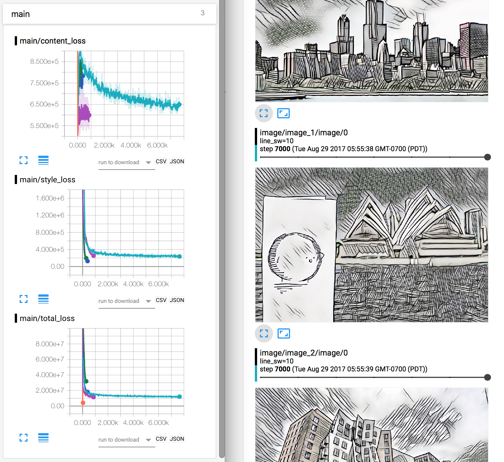

# fast-style-transfer
Fast style transfer in TensorFlow

Our implementation is based off Lengstrom's [implementation](https://github.com/lengstrom/fast-style-transfer). The following modifications where made:

1. Transpose convolutions were replaced with nearest neighbor upsampling, based on Odena's [Deconvolution and Checkerboard Artifacts](https://distill.pub/2016/deconv-checkerboard/).
2. Zero-padding replaced with reflection-padding in convolutions, based on Dumoulin's [A Learned Representation For Artistic Style](https://arxiv.org/abs/1610.07629).
3. Added Tensorboard visualizations.

## Dependencies
```bash
python==2.7
numpy==1.13.0
scipy==0.18.1
tensorflow==1.1.0
tensorbayes==0.2.0
ffmpeg==3.2.2
```

## Run style transfer
**Get training data**

Get data and VGG weights for training:
```
sh get_data.sh
```

**Train model**

Example of training with target style `data/styles/hatch.jpg`:
```
python main.py train \
  --content-weight 15 \
  --style-weight 100 \
  --target-style data/styles/hatch.jpg \
  --validation-dir data/validation
```
Models are automatically saved to `checkpoints/MODEL_NAME` where `MODEL_NAME` is `STYLE_sw=STYLE_WEIGHT` (e.g. `checkpoints/hatch_sw=100`). A validation directory is required to monitor the visual performance of the fast-style-transfer network. The default arguments work fairly well, so the only thing you really need to provide is the target style.

**Test model**

Once trained we can test the model on, for example, images in the `data/validation` directory:
```
python main.py test \
  --model-name MODEL_NAME \
  --ckpt CKPT \
  --test-dir data/validation \
```
If `--ckpt` is not provided, the latest checkpoint from `checkpoints/MODEL_NAME` is loaded.

Or if you have a specific jpg/png/mp4 file:
```
python main.py test \
  --model-name MODEL_NAME \
  --ckpt CKPT \
  --test-dir path/to/test/file
```
Here is style transfer applied to Linkin Park's Numb :D
<div align = 'center'>

</div>

## Tensorboard visualization

A tensorboard summary is created and saved in `log` when training the model. You can see how the model is doing there.

